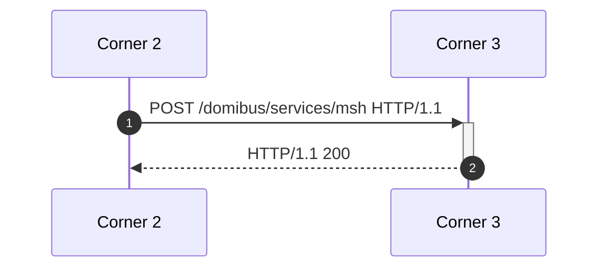

# Messaging protocol in e-delivery

## Example message sequence with default configuration

These data were generated using the above steps. For context, recall that e-delivery works in a four-corner model:

```
Corner 1:         Corner 4:
Agent A           Agent B
   |                  ^
   |                  |
   v                  |
Corner 2:  -----> Corner 3:
Provider A        Provider B
```

For sending a message, e-delivery only standardises the interaction between Corner 2 and Corner 3. Domibus implements the AS4 profile, which works as follows:



### Message 1: SOAP envelope with ebMS user message

HTTP request:

```
POST /domibus/services/msh HTTP/1.1
Content-Type: multipart/related; type="application/soap+xml"; boundary="uuid:480dc24b-2c88-4bf8-9220-9c457d90bdec"; start="<root.message@cxf.apache.org>"; start-info="application/soap+xml"
Accept: */*
User-Agent: Apache-CXF/3.5.9
Cache-Control: no-cache
Pragma: no-cache
Host: web-red:8080
Connection: keep-alive
Content-Length: 7714

--uuid:480dc24b-2c88-4bf8-9220-9c457d90bdec
Content-Type: application/soap+xml; charset=UTF-8
Content-Transfer-Encoding: binary
Content-ID: <root.message@cxf.apache.org>

-%<- request SOAP envelope extracted, see below -%<-

--uuid:480dc24b-2c88-4bf8-9220-9c457d90bdec
Content-Type: application/octet-stream
Content-Transfer-Encoding: binary
Content-ID: <message>

-%<- gzip-encoded XML hello world message omitted -%<-

--uuid:480dc24b-2c88-4bf8-9220-9c457d90bdec--
```

Request SOAP envelope, with XML reformatted:

```xml
<env:Envelope xmlns:env="http://www.w3.org/2003/05/soap-envelope">
  <env:Header>
    <eb:Messaging env:mustUnderstand="true" wsu:Id="_1c3270ff4aa721041e0ca355ec7cba56d241a927f39a33756685dd401455f19d8" xmlns:eb="http://docs.oasis-open.org/ebxml-msg/ebms/v3.0/ns/core/200704/" xmlns:wsu="http://docs.oasis-open.org/wss/2004/01/oasis-200401-wss-wssecurity-utility-1.0.xsd">
      <eb:UserMessage mpc="http://docs.oasis-open.org/ebxml-msg/ebms/v3.0/ns/core/200704/defaultMPC">
        <eb:MessageInfo>
          <eb:Timestamp>2025-02-25T07:23:40.000Z</eb:Timestamp>
          <eb:MessageId>6f9591ff-f349-11ef-ae4f-0242ac130005@domibus.eu</eb:MessageId>
        </eb:MessageInfo>
        <eb:PartyInfo>
          <eb:From>
            <eb:PartyId type="urn:oasis:names:tc:ebcore:partyid-type:unregistered">domibus-blue</eb:PartyId>
            <eb:Role>http://docs.oasis-open.org/ebxml-msg/ebms/v3.0/ns/core/200704/initiator</eb:Role>
          </eb:From>
          <eb:To>
            <eb:PartyId type="urn:oasis:names:tc:ebcore:partyid-type:unregistered">domibus-red</eb:PartyId>
            <eb:Role>http://docs.oasis-open.org/ebxml-msg/ebms/v3.0/ns/core/200704/responder</eb:Role>
          </eb:To>
        </eb:PartyInfo>
        <eb:CollaborationInfo>
          <eb:Service type="tc1">bdx:noprocess</eb:Service>
          <eb:Action>TC1Leg1</eb:Action>
          <eb:ConversationId>6f960730-f349-11ef-ae4f-0242ac130005@domibus.eu</eb:ConversationId>
        </eb:CollaborationInfo>
        <eb:MessageProperties>
          <eb:Property name="originalSender">urn:oasis:names:tc:ebcore:partyid-type:unregistered:C1</eb:Property>
          <eb:Property name="finalRecipient">urn:oasis:names:tc:ebcore:partyid-type:unregistered:C4</eb:Property>
        </eb:MessageProperties>
        <eb:PayloadInfo>
          <eb:PartInfo href="cid:message">
            <eb:PartProperties>
              <eb:Property name="MimeType">application/json</eb:Property>
              <eb:Property name="CompressionType">application/gzip</eb:Property>
            </eb:PartProperties>
          </eb:PartInfo>
        </eb:PayloadInfo>
      </eb:UserMessage>
    </eb:Messaging>
    <wsse:Security env:mustUnderstand="true" xmlns:wsse="http://docs.oasis-open.org/wss/2004/01/oasis-200401-wss-wssecurity-secext-1.0.xsd" xmlns:wsu="http://docs.oasis-open.org/wss/2004/01/oasis-200401-wss-wssecurity-utility-1.0.xsd">
      <xenc:EncryptedKey Id="EK-3cbc4f3a-83ed-4d1c-b8a7-42e472467bd2" xmlns:xenc="http://www.w3.org/2001/04/xmlenc#">
        <xenc:EncryptionMethod Algorithm="http://www.w3.org/2009/xmlenc11#rsa-oaep">
          <ds:DigestMethod Algorithm="http://www.w3.org/2001/04/xmlenc#sha256" xmlns:ds="http://www.w3.org/2000/09/xmldsig#"/>
          <xenc11:MGF Algorithm="http://www.w3.org/2009/xmlenc11#mgf1sha256" xmlns:xenc11="http://www.w3.org/2009/xmlenc11#"/>
        </xenc:EncryptionMethod>
        <ds:KeyInfo xmlns:ds="http://www.w3.org/2000/09/xmldsig#">
          <wsse:SecurityTokenReference>
            <wsse:KeyIdentifier EncodingType="http://docs.oasis-open.org/wss/2004/01/oasis-200401-wss-soap-message-security-1.0#Base64Binary" ValueType="http://docs.oasis-open.org/wss/2004/01/oasis-200401-wss-x509-token-profile-1.0#X509SubjectKeyIdentifier">7AJeAnEL5EE5l3lLc+EoFpOfJCo=</wsse:KeyIdentifier>
          </wsse:SecurityTokenReference>
        </ds:KeyInfo>
        <xenc:CipherData>
          <xenc:CipherValue>vrztWlz/2/5n+zV6TuspNsfG8ENi16fCnaMnT0msknZO/DEaVkVN/cpxIlWL7bYIFUIV3hjYvHzjSRshC6hF06Yw8JQNFVlbuXZDXTlbPCGZQ0OMYm8EjcO4KrWRqtPjZmn3q67kJHPINuMJNpkcPDTGzaFG+HUNuIj8++yFkK6R7ZeKXMrj6hwhulXOsWnxJ+VqwSj0IIA5p00vfICceTzNG9Hpfkjq88WJKz3a9XY4ztBAMpQqBg+9BW3s8dLBgrggKudoQ+Li6iNO2eF2FrVnXXLj7zv7FCG0lIsAjYbj+SkhAvzQ9PqekQPz9LAVwiQxkCMB0bBsht2Ef8XVYw==</xenc:CipherValue>
        </xenc:CipherData>
        <xenc:ReferenceList>
          <xenc:DataReference URI="#ED-ba2dabd9-e5e3-4d9c-b477-fe1b2afb65aa"/>
        </xenc:ReferenceList>
      </xenc:EncryptedKey>
      <xenc:EncryptedData Id="ED-ba2dabd9-e5e3-4d9c-b477-fe1b2afb65aa" MimeType="application/gzip" Type="http://docs.oasis-open.org/wss/oasis-wss-SwAProfile-1.1#Attachment-Content-Only" xmlns:xenc="http://www.w3.org/2001/04/xmlenc#">
        <xenc:EncryptionMethod Algorithm="http://www.w3.org/2009/xmlenc11#aes128-gcm"/>
        <ds:KeyInfo xmlns:ds="http://www.w3.org/2000/09/xmldsig#">
          <wsse:SecurityTokenReference wsse11:TokenType="http://docs.oasis-open.org/wss/oasis-wss-soap-message-security-1.1#EncryptedKey" xmlns:wsse="http://docs.oasis-open.org/wss/2004/01/oasis-200401-wss-wssecurity-secext-1.0.xsd" xmlns:wsse11="http://docs.oasis-open.org/wss/oasis-wss-wssecurity-secext-1.1.xsd">
            <wsse:Reference URI="#EK-3cbc4f3a-83ed-4d1c-b8a7-42e472467bd2"/>
          </wsse:SecurityTokenReference>
        </ds:KeyInfo>
        <xenc:CipherData>
          <xenc:CipherReference URI="cid:message">
            <xenc:Transforms>
              <ds:Transform Algorithm="http://docs.oasis-open.org/wss/oasis-wss-SwAProfile-1.1#Attachment-Ciphertext-Transform" xmlns:ds="http://www.w3.org/2000/09/xmldsig#"/>
            </xenc:Transforms>
          </xenc:CipherReference>
        </xenc:CipherData>
      </xenc:EncryptedData>
      <ds:Signature Id="SIG-cbd99e8f-d8e7-4195-98d1-eab787158510" xmlns:ds="http://www.w3.org/2000/09/xmldsig#">
        <ds:SignedInfo>
          <ds:CanonicalizationMethod Algorithm="http://www.w3.org/2001/10/xml-exc-c14n#">
            <ec:InclusiveNamespaces PrefixList="env" xmlns:ec="http://www.w3.org/2001/10/xml-exc-c14n#"/>
          </ds:CanonicalizationMethod>
          <ds:SignatureMethod Algorithm="http://www.w3.org/2001/04/xmldsig-more#rsa-sha256"/>
          <ds:Reference URI="#_2c3270ff4aa721041e0ca355ec7cba56d241a927f39a33756685dd401455f19d8">
            <ds:Transforms>
              <ds:Transform Algorithm="http://www.w3.org/2001/10/xml-exc-c14n#"/>
            </ds:Transforms>
            <ds:DigestMethod Algorithm="http://www.w3.org/2001/04/xmlenc#sha256"/>
            <ds:DigestValue>yMGE6bJ7ncOvyGk6wolvWrqHzOAQzAAthCPxQ/XG2Xg=</ds:DigestValue>
          </ds:Reference>
          <ds:Reference URI="#_1c3270ff4aa721041e0ca355ec7cba56d241a927f39a33756685dd401455f19d8">
            <ds:Transforms>
              <ds:Transform Algorithm="http://www.w3.org/2001/10/xml-exc-c14n#"/>
            </ds:Transforms>
            <ds:DigestMethod Algorithm="http://www.w3.org/2001/04/xmlenc#sha256"/>
            <ds:DigestValue>GwP/Xc75vTasKpFhnXhpXdd54s/sf040IC8cAiYU3Rs=</ds:DigestValue>
          </ds:Reference>
          <ds:Reference URI="cid:message">
            <ds:Transforms>
              <ds:Transform Algorithm="http://docs.oasis-open.org/wss/oasis-wss-SwAProfile-1.1#Attachment-Content-Signature-Transform"/>
            </ds:Transforms>
            <ds:DigestMethod Algorithm="http://www.w3.org/2001/04/xmlenc#sha256"/>
            <ds:DigestValue>25Fd3El8OiBf1izqXhOSlFtoKyhoQtZPgPfNRiUyQfU=</ds:DigestValue>
          </ds:Reference>
        </ds:SignedInfo>
        <ds:SignatureValue>YyuX6TSByZb9q6gonHqYFq54dXgmA9kbAlrw1sureT9wzGBrnwROTZB3koU0VllHJrYd+fV/SRJom7PZjx3xCOfwGsD9lqu9xg6hIq2OGfXrxArMFyGRKQ98k6K6uiTEv87Bemp0b6nItnZH3xS592Pgb9uyqtSUcDbDbgBZF34Z/RocYPdEcFi+oek+D6NSZHtFbQkG3PDs0ohI4axRof/dmbsxxD2v2GWHsQ/1Y05bx1GYF5oIspqN4tdzZxVldtJMU6tfKp/eSRtVMGlI12PVrRXr3RFTKsrz5Y3S9U5C8d1Z94+HF88/58XQvPTsweGcjVauwbf/UGhgcQj1+g==</ds:SignatureValue>
        <ds:KeyInfo Id="KI-bde233fe-b1ee-46de-b013-b46a05d7af2e">
          <wsse:SecurityTokenReference wsu:Id="STR-13a946f7-d8f8-4c82-a63f-0a1e41201521" xmlns:wsse="http://docs.oasis-open.org/wss/2004/01/oasis-200401-wss-wssecurity-secext-1.0.xsd" xmlns:wsu="http://docs.oasis-open.org/wss/2004/01/oasis-200401-wss-wssecurity-utility-1.0.xsd">
            <wsse:KeyIdentifier EncodingType="http://docs.oasis-open.org/wss/2004/01/oasis-200401-wss-soap-message-security-1.0#Base64Binary" ValueType="http://docs.oasis-open.org/wss/2004/01/oasis-200401-wss-x509-token-profile-1.0#X509SubjectKeyIdentifier">HPqVjsgDN900CCgLwAvG03x+R2I=</wsse:KeyIdentifier>
          </wsse:SecurityTokenReference>
        </ds:KeyInfo>
      </ds:Signature>
    </wsse:Security>
  </env:Header>
  <env:Body wsu:Id="_2c3270ff4aa721041e0ca355ec7cba56d241a927f39a33756685dd401455f19d8" xmlns:wsu="http://docs.oasis-open.org/wss/2004/01/oasis-200401-wss-wssecurity-utility-1.0.xsd"/>
</env:Envelope>
```

### Message 2: SOAP envelope with ebMS signal message

HTTP response:

```
HTTP/1.1 200 
Content-Type: application/soap+xml;charset=UTF-8
Content-Length: 5130
Date: Tue, 25 Feb 2025 07:23:43 GMT
Keep-Alive: timeout=20
Connection: keep-alive
```

```xml
<S12:Envelope xmlns:S12="http://www.w3.org/2003/05/soap-envelope" xmlns:ds="http://www.w3.org/2000/09/xmldsig#" xmlns:eb3="http://docs.oasis-open.org/ebxml-msg/ebms/v3.0/ns/core/200704/" xmlns:ebbp="http://docs.oasis-open.org/ebxml-bp/ebbp-signals-2.0" xmlns:ebint="http://docs.oasis-open.org/ebxml-msg/ebms/v3.0/ns/multihop/200902/" xmlns:wsa="http://www.w3.org/2005/08/addressing" xmlns:wsse="http://docs.oasis-open.org/wss/2004/01/oasis-200401-wss-wssecurity-secext-1.0.xsd" xmlns:wsu="http://docs.oasis-open.org/wss/2004/01/oasis-200401-wss-wssecurity-utility-1.0.xsd">
  <S12:Header>
    <eb3:Messaging S12:mustUnderstand="true" id="_ebmessaging_N65541" wsu:Id="_1c3270ff4aa721041e0ca355ec7cba56d241a927f39a33756685dd401455f19d8">
      <eb3:SignalMessage>
        <eb3:MessageInfo>
          <eb3:Timestamp>2025-02-25T07:23:42.000Z</eb3:Timestamp>
          <eb3:MessageId>7107e684-f349-11ef-bc48-0242ac130004@domibus.eu</eb3:MessageId>
          <eb3:RefToMessageId>6f9591ff-f349-11ef-ae4f-0242ac130005@domibus.eu</eb3:RefToMessageId>
        </eb3:MessageInfo>
        <eb3:Receipt>
          <ebbp:NonRepudiationInformation>
            <ebbp:MessagePartNRInformation>
              <ds:Reference URI="#_2c3270ff4aa721041e0ca355ec7cba56d241a927f39a33756685dd401455f19d8" xmlns:env="http://www.w3.org/2003/05/soap-envelope">
                <ds:Transforms>
                  <ds:Transform Algorithm="http://www.w3.org/2001/10/xml-exc-c14n#"/>
                </ds:Transforms>
                <ds:DigestMethod Algorithm="http://www.w3.org/2001/04/xmlenc#sha256"/>
                <ds:DigestValue>yMGE6bJ7ncOvyGk6wolvWrqHzOAQzAAthCPxQ/XG2Xg=</ds:DigestValue>
              </ds:Reference>
            </ebbp:MessagePartNRInformation>
            <ebbp:MessagePartNRInformation>
              <ds:Reference URI="#_1c3270ff4aa721041e0ca355ec7cba56d241a927f39a33756685dd401455f19d8" xmlns:env="http://www.w3.org/2003/05/soap-envelope">
                <ds:Transforms>
                  <ds:Transform Algorithm="http://www.w3.org/2001/10/xml-exc-c14n#"/>
                </ds:Transforms>
                <ds:DigestMethod Algorithm="http://www.w3.org/2001/04/xmlenc#sha256"/>
                <ds:DigestValue>GwP/Xc75vTasKpFhnXhpXdd54s/sf040IC8cAiYU3Rs=</ds:DigestValue>
              </ds:Reference>
            </ebbp:MessagePartNRInformation>
            <ebbp:MessagePartNRInformation>
              <ds:Reference URI="cid:message" xmlns:env="http://www.w3.org/2003/05/soap-envelope">
                <ds:Transforms>
                  <ds:Transform Algorithm="http://docs.oasis-open.org/wss/oasis-wss-SwAProfile-1.1#Attachment-Content-Signature-Transform"/>
                </ds:Transforms>
                <ds:DigestMethod Algorithm="http://www.w3.org/2001/04/xmlenc#sha256"/>
                <ds:DigestValue>25Fd3El8OiBf1izqXhOSlFtoKyhoQtZPgPfNRiUyQfU=</ds:DigestValue>
              </ds:Reference>
            </ebbp:MessagePartNRInformation>
          </ebbp:NonRepudiationInformation>
        </eb3:Receipt>
      </eb3:SignalMessage>
    </eb3:Messaging>
    <wsse:Security S12:mustUnderstand="true" xmlns:wsse="http://docs.oasis-open.org/wss/2004/01/oasis-200401-wss-wssecurity-secext-1.0.xsd">
      <ds:Signature Id="SIG-380feca4-be72-4e11-9774-8a30caa49f48" xmlns:ds="http://www.w3.org/2000/09/xmldsig#">
        <ds:SignedInfo>
          <ds:CanonicalizationMethod Algorithm="http://www.w3.org/2001/10/xml-exc-c14n#">
            <ec:InclusiveNamespaces PrefixList="S12 ds eb3 ebbp ebint wsa wsse wsu" xmlns:ec="http://www.w3.org/2001/10/xml-exc-c14n#"/>
          </ds:CanonicalizationMethod>
          <ds:SignatureMethod Algorithm="http://www.w3.org/2001/04/xmldsig-more#rsa-sha256"/>
          <ds:Reference URI="#N65667">
            <ds:Transforms>
              <ds:Transform Algorithm="http://www.w3.org/2001/10/xml-exc-c14n#">
                <ec:InclusiveNamespaces PrefixList="ds eb3 ebbp ebint wsa wsse" xmlns:ec="http://www.w3.org/2001/10/xml-exc-c14n#"/>
              </ds:Transform>
            </ds:Transforms>
            <ds:DigestMethod Algorithm="http://www.w3.org/2001/04/xmlenc#sha256"/>
            <ds:DigestValue>NBmyTYEkY9uwsu8bCkiPxgjDiHrxETu8f1q1yxvz1Kk=</ds:DigestValue>
          </ds:Reference>
          <ds:Reference URI="#_1c3270ff4aa721041e0ca355ec7cba56d241a927f39a33756685dd401455f19d8">
            <ds:Transforms>
              <ds:Transform Algorithm="http://www.w3.org/2001/10/xml-exc-c14n#">
                <ec:InclusiveNamespaces PrefixList="ds ebbp ebint wsa wsse" xmlns:ec="http://www.w3.org/2001/10/xml-exc-c14n#"/>
              </ds:Transform>
            </ds:Transforms>
            <ds:DigestMethod Algorithm="http://www.w3.org/2001/04/xmlenc#sha256"/>
            <ds:DigestValue>Naep8RNuOkbSb+gM3JljFrfZrx/r5lI6LeyQs6dTx58=</ds:DigestValue>
          </ds:Reference>
        </ds:SignedInfo>
        <ds:SignatureValue>YdsYVtN73AP+ypz9ev0wFTh0Rcw9yZ+JB4R+QQt/FP9s7sgZnQY2Up90otvnP2oIrKbvZAh0YbsJNow8i+wb/4ElNkmhX8SQEBifZWfYoCA304R0nBqwg5m+OEPIbX8a/t0XsJ7RgdK3cTLEi9qlMWKu/q8efHxg1+Tvu4MARetEZN1pIM6OTc6I/oZFXl8syNhyaXxghREmDDpkjBisQWRN6JpGGKYItR2zqJ/dZhlvrxThizfuzoUE9QjDf28tROF5OH7Q8akNw77TiVWlddMBDoS3IohXvdKedfhIBT+2w11S4brtE+3c4VgDvTSX/n0GNhAIVDCcaZ8SnfbbDg==</ds:SignatureValue>
        <ds:KeyInfo Id="KI-e5b07d2e-f2fa-40c1-99f1-6fd0b6633302">
          <wsse:SecurityTokenReference wsu:Id="STR-926ca42a-1ebc-4b6c-8fbd-24633f13a6f8" xmlns:wsse="http://docs.oasis-open.org/wss/2004/01/oasis-200401-wss-wssecurity-secext-1.0.xsd" xmlns:wsu="http://docs.oasis-open.org/wss/2004/01/oasis-200401-wss-wssecurity-utility-1.0.xsd">
            <wsse:KeyIdentifier EncodingType="http://docs.oasis-open.org/wss/2004/01/oasis-200401-wss-soap-message-security-1.0#Base64Binary" ValueType="http://docs.oasis-open.org/wss/2004/01/oasis-200401-wss-x509-token-profile-1.0#X509SubjectKeyIdentifier">7AJeAnEL5EE5l3lLc+EoFpOfJCo=</wsse:KeyIdentifier>
          </wsse:SecurityTokenReference>
        </ds:KeyInfo>
      </ds:Signature>
    </wsse:Security>
  </S12:Header>
  <S12:Body wsu:Id="N65667"/>
</S12:Envelope>
```
